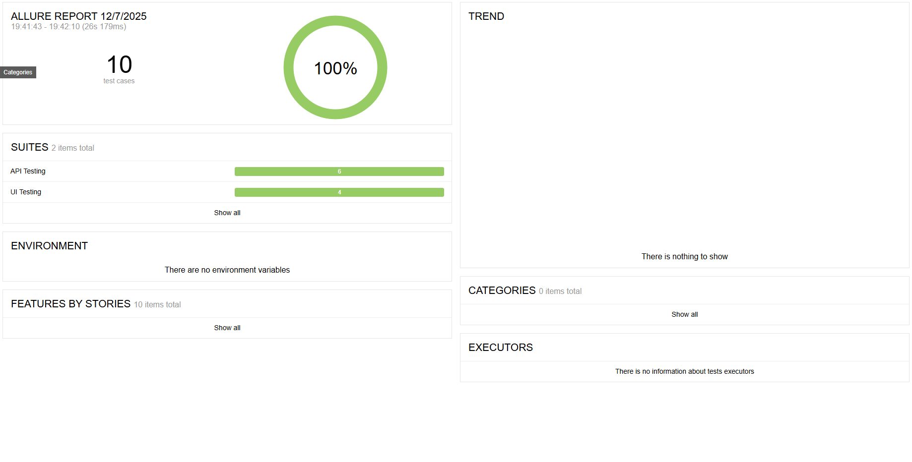

# Saucedemo UI & API Tests

> End-to-end test project built with [CodeceptJS](https://codecept.io/), using Playwright, TypeScript, and Allure for reporting.

---

## Table of Contents
- [Project Overview](#project-overview)
- [Technologies](#technologies)
- [Installation](#installation)
- [Running Tests](#running-tests)
- [Demo and UI](#demo-and-ui)
- [Test Reporting](#test-reporting)
- [Contact](#contact)

---

## Project Overview
This repository contains example automated tests for web applications using CodeceptJS.  
It is configured to run tests in headless mode or with UI, and integrates with Allure for detailed test reporting.

---

## Technologies
- [CodeceptJS](https://codecept.io/) – end-to-end testing framework  
- [Playwright](https://playwright.dev/) – browser automation  
- [TypeScript](https://www.typescriptlang.org/) – typed JavaScript  
- [Allure](https://docs.qameta.io/allure/) – test reporting  
- [Chai](https://www.chaijs.com/) – assertions  

---

## Installation
1. Clone the repository:
    ```bash
    git clone https://github.com/nikodemgodek/nexontis.git
    cd nexontis
    ```
2. Install dependencies:
    ```bash
    npm install
    ```
3. Don't forget to create `.env` file with sensitive data in general directory:
    ```bash
    BASE_URL=https://saucedemo.com
    
    STANDARD_USER=standard_user
    STANDARD_USER_PASS=<<secret_password>>

    PROBLEM_USER=problem_user
    PROBLEM_USER_PASS=<<secret_password>>

    LOCKED_USER=locked_out_user
    LOCKED_USER_PASS=<<secret_password>>

    API_BASE_URL=https://reqres.in/api
    API_KEY=<<your_api_key>>
    API_TIMEOUT=5000
    ```


---

## Running Tests
This project includes ready-to-use npm scripts in `package.json`.

- Run all tests in interactive mode:
    ```bash
    npm run codeceptjs
    ```
- Run tests in headless mode (no browser UI):
    ```bash
    npx codeceptjs run --steps --override '{ "helpers": { "Playwright": { "show": false } } }'

    ```
- Run tests in multiple browsers: Firefox, Chromium, Webkit
    ```bash
    npx codeceptjs run-multiple firefox chromium webkit

    ```
---

## Test Reporting
This project supports Allure reporting:

Generate and serve the report:
    ```bash
    allure serve ./allure-results
    ```

---

## Test Execution



## Contact
This project is intended for educational and demonstration purposes.  
Questions or suggestions? Reach out via [linkedin](https://linked.in/in/nikodemgodek).
